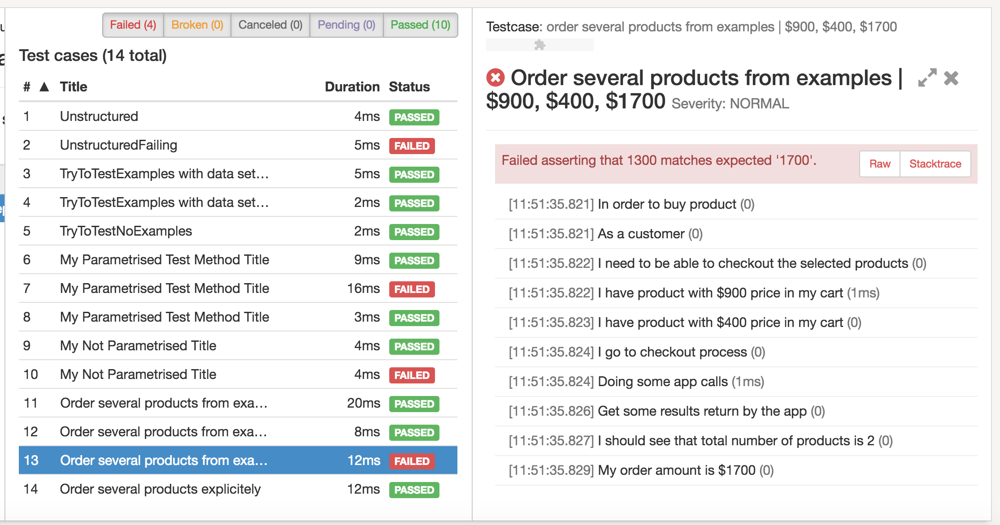
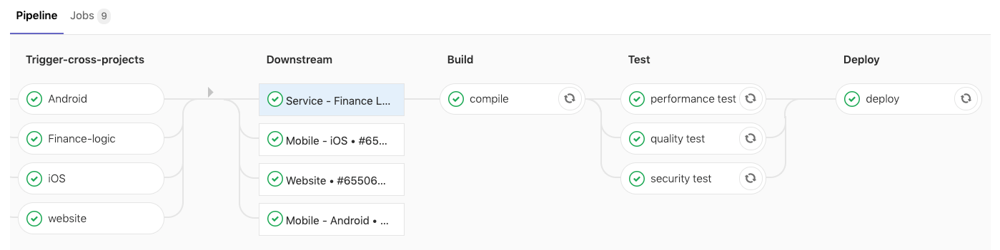

# fintech-web-mobile-qa-demo

Демо-проект, основанный на моём опыте тестирования финтех-приложений (web + mobile).  
Цель репозитория — показать подход к проектированию автотестов и QA-артефактов без раскрытия кода под NDA.

## О проекте

- Домашний “банк” с оформлением и обслуживанием займа
- Web-интерфейс + мобильное приложение
- Основной фокус: стабильный регресс, прозрачные отчёты и интеграция с CI/CD

## Стек

- Язык: Java  
- UI: Selenide  
- API: Rest Assured  
- Тестовый фреймворк: JUnit 5  
- Отчётность: Allure  
- CI/CD: GitLab CI

## Структура репозитория

- `ui-tests/` — примеры UI-автотестов (web + mobile web)
- `api-tests/` — примеры API-тестов (REST)
- `checklists/` — чек-листы для регресса и стабильности
- `test-plan.md` — укрупнённый тест-план по проекту
- `test-cases.md` — примеры тест-кейсов
- `bugreports.md` — примеры баг-репортов

## Архитектура автотестов (концепция)

В боевом проекте фреймворк строился по слоям:

Пример структуры:
framework/core/BaseTest.java
framework/pages/LoginPage.java
framework/api/LoanApi.java

- `core` — базовые классы (`BaseTest`, конфигурация, логирование)
- `pages` — Page Object-ы для экранов/страниц
- `api` — клиент для REST-запросов и обёртки над Rest Assured
- `data` — data builders и тестовые данные
- `utils` — вспомогательные утилиты (matchers, генераторы, валидация)

В этом репозитории показана упрощённая структура и подход, без бизнес-логики заказчика.

## Запуск тестов (концепция)

Локальный запуск (пример из реального проекта):

```bash
mvn clean test -Denv=stage -Dthreads=4
```

## Визуализация отчетности и CI/CD

Пример Allure-отчета:


Пример пайплайна GitLab CI:


## Highlights

- Построена архитектура автотестов на Java с применением **Selenide**, **Rest Assured**, **JUnit5**, **Allure**, **GitLab CI**  
- Разработана концепция **data builders** и генераторов тестовых данных для повышения стабильности тестов  
- Настроена **JSON Schema Validation** и отчётность Allure для прозрачных метрик качества  
- Реализована интеграция автотестов в **CI/CD pipeline** с nightly regression и smoke-проверками на каждый MR  
- Используется подход **Page Object + Layered Architecture** для читаемости и переиспользования кода  
- Продемонстрировано понимание полного QA-процесса: тест-планирование, чек-листы, баг-репорты, регрессия  

> Все решения адаптированы под демо-формат, без раскрытия кода под NDA.
